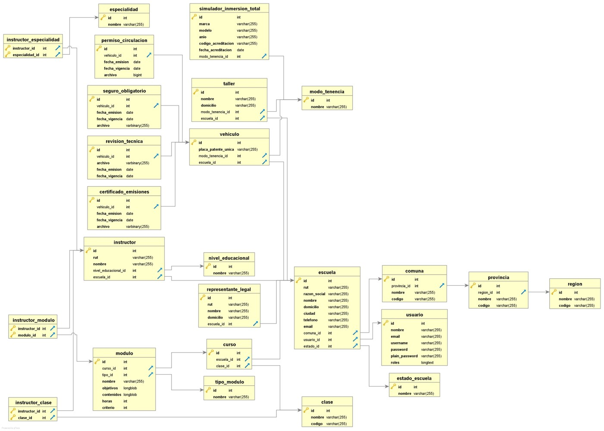

# Descripción de la Solución

## Resumen

La idea de la solución es generar una plataforma donde puedan acceder tanto desde la Escuela de conductores como la Seremitt y la División de Normas y Operaciones de la Subsecretaría de Transportes para informar y revisar los nuevos registros en relación a este negocio. Se debe cubrir información acerca de:

* La sociedad
* Los programas de enseñanza
* Instructores
* Vehículos
* Insfraestructura de la sede

## Lenguaje

dñlfksdñflksdñflk

## Base de datos

Base de datos preliminar 

## Procesos

### Aprobación de una Escuela 

### Suspensión

El proceso comienza con Fiscalización enviando el NDF, que posteriormente subirá a la plataforma el Encargado de Escuelas.  Una suspensión actualmente solo es posible si la Escuela tiene vencida una póliza de seguro de al menos uno de los vehículos de instrucción práctica. Una vez que se genera la Resolución de Suspensión la cargará al sistema y actualizará el Estado de la Escuela, enviando una notificación a la ECP.

La Escuela podrá subir a la plataforma la póliza nueva, dando aviso al Encargado de Escuelas, que la revisará y generará la Resolución que Levanta la Suspensión, la cual subirá a la plataforma y cambiará el estado, informando a la Escuela.

Si la Escuela nota que una póliza está vencida, también podrá auto suspenderse, informando a la Seremitt. El proceso para volver a estar habilitada es el mismo del punto anterior.

### Revocación

#### Descripción actividades

El proceso comienza con la visita de Fiscalización donde envían el NDF correspondiente a la Seremitt. En el caso que el acta indique un incumplimiento que amerite revocación se redacta una Resolución de Revocación la cual se notifica a la ECP y a DNO \(para actualización de la nómina\). La ECP tiene 30 días para redactar un recurso de reconsideración, que se envía a la Seremitt y se evalúa nuevamente.

De esta segunda evaluación puede generarse una Resolución que acoge la reconsideración o una Resolución que confirma la revocación. En ambos casos se informa a la ECP y a DNO.

Si se emitió una resolución que confirma la revocación, la ECP tiene 10 días para redactar una reclamación ante la corte de apelaciones, quien emite un fallo. La Seremitt revisa el fallo y si la Corte acoge la reclamación redacta una Resolución que deja sin efecto la revocación, la que informa a ECP y a DNO para actualizar la nómina.

En los casos que la Revocación continúa, es decir, Cuando no se acoge la reconsideración o la Reclamación, en la Seremitt se redacta un Memorándum a Fiscalización, quien va a la ECP y retira los certificados y emite el Acta de Cierre. Finalmente, la Seremitt comunica el último folio válido de la ECP a las municipalidades.

#### Roles

* Fiscalización
* Seremitt
* DNO
* Escuela de Conductores
* Corte de Apelaciones

#### Documentos

* NDF
* Resolución de Revocación
* Recurso de Reconsideración
* Resolución que acoge la reconsideración
* Resolución que confirma revocación
* Reclamación
* Fallo de Corte de Apelaciones
* Resolución que deja sin efecto la revocación
* Memorándum para cierre ECP
* Acta de cierre ECP
* Comunicación a municipalidades con último folio válido

#### Propuesta

Se propone que el proceso sea llevado por la Seremitt en la carga de documentos, excepto por el recurso de reconsideración, que debería ser ingresado por la Escuela de Conductores.

Una vez que el proyecto incluya la generación de certificados, no será necesario informar el último folio válido.

